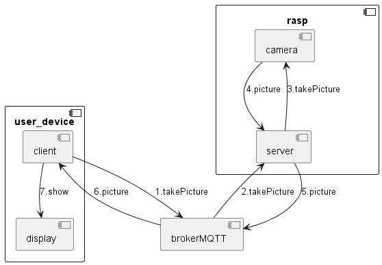

# PiCam-everywhere
This project is based on a Pi 4, mqtt communication, python and bash script.  

## Progress
| Title           | State |
| --------------- | ----- |
| COMPLETE SYSTEM | DONE  |
| simple client   | done  |
| simple server   | done  |
| take Picture    | done  |
| send picture    | done  |
| get picture     | done  |
| graph interface | done  |

## Getting started
### Webcam side
* Clone the repo on your rasp (or other)
* Plug your Camera (I use USB camera)
* Add to systemd to run at boot : 
```
sudo ln picam-everywhere/src/rasp/picam.service /etc/systemd/system/
sudo systemctl enable picam.service
sudo systemctl daemon-reload
sudo systemctl start picam.service
```
### Client side
* Clone the repo on your rasp (or other)
* Launch the client using python

## Principle

## Developper
Guilhem ROLLAND